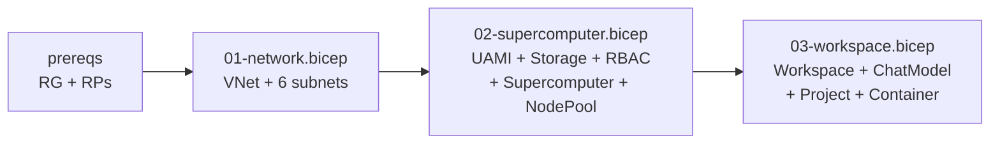
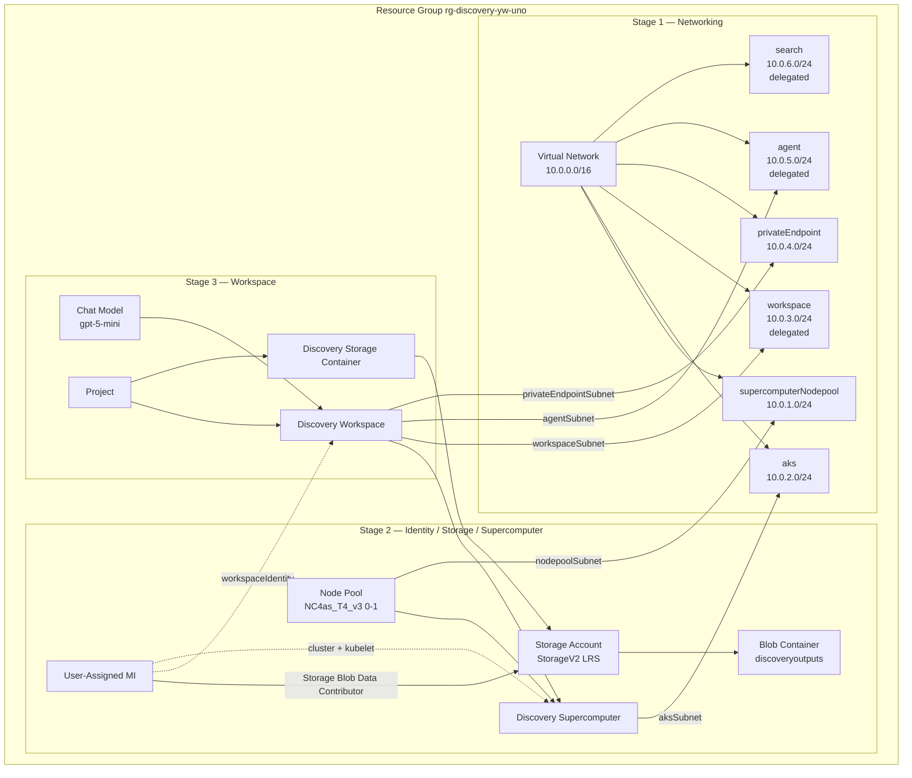

# Microsoft Discovery — Deployment Architecture

This deployment is split into **3 independent Bicep stages** so you can iterate on each layer without touching the others.

All resources land in a **single resource group** in **one region** (default `swedencentral`).
Default naming prefix: `disc-yw` (e.g. `vnet-disc-yw`, `sc-disc-yw`, `ws-disc-yw`).

## Stage layout

Stages 2 and 3 reuse resources from earlier stages via `existing` references (look up by name).

## Full resource graph

## Resource-by-resource breakdown

### Stage 1 — `01-network.bicep`

| Resource | Purpose |
|---|---|
| `Microsoft.Network/virtualNetworks` | VNet `10.0.0.0/16` carrying all Discovery traffic. Address space + every subnet CIDR is parameterized. |
| 6 subnets | One per workload tier. Three (`workspace`, `agent`, `search`) are **delegated to `Microsoft.App/environments`**. |

**Customize:** `vnetAddressPrefix`, `*SubnetPrefix`, `prefix`, `location`.

### Stage 2 — `02-supercomputer.bicep`

| Resource | Purpose |
|---|---|
| `Microsoft.ManagedIdentity/userAssignedIdentities` | Single UAMI reused by Supercomputer (cluster + kubelet + workload) and by Workspace in Stage 3. |
| `Microsoft.Storage/storageAccounts` | StorageV2, LRS, hot tier, **no public blob access**, **no shared-key access** (AAD only), TLS 1.2. |
| `blobServices` (default) | CORS rules for `studio.discovery.microsoft.com`, `vscode.dev`, VS Code CDN. |
| `containers/discoveryoutputs` | Underlying blob container for Discovery outputs. |
| 3× `roleAssignments` | UAMI gets **Storage Blob Data Contributor** (storage), **Discovery Platform Contributor** (RG), **AcrPull** (RG). |
| `Microsoft.Discovery/supercomputers` | Wired to `aksSubnet` + UAMI. |
| `Microsoft.Discovery/supercomputers/nodePools` | Default `Standard_NC4as_T4_v3` (T4 GPU), **min 0 / max 1** (scale-to-zero), Regular priority. |

**Customize via [deploy.sh](deploy.sh) CONFIG block:** `NODE_POOL_VM_SIZE`, `NODE_POOL_MIN_NODE_COUNT`, `NODE_POOL_MAX_NODE_COUNT`, `NODE_POOL_PRIORITY` (Regular/Spot).

Other SKU examples: `Standard_D4s_v6` (CPU-only), `Standard_NC24ads_A100_v4` (A100 GPU).

### Stage 3 — `03-workspace.bicep`

| Resource | Purpose |
|---|---|
| `Microsoft.Discovery/workspaces` | The user-facing Workspace, bound to the Supercomputer + workspace/agent/PE subnets. |
| `Microsoft.Discovery/workspaces/chatModelDeployments` | Deploys `gpt-5-mini` — set `CHAT_MODEL_NAME=""` in `deploy.sh` to skip. |
| `Microsoft.Discovery/storageContainers` | Discovery's logical storage handle pointing at the storage account from Stage 2. |
| `Microsoft.Discovery/workspaces/projects` | Default project, linked to the storage container. |

**Customize via [deploy.sh](deploy.sh) CONFIG block:** `CHAT_MODEL_NAME`. Stage 3 also takes `storageAccountName` — `deploy.sh` reads it automatically from Stage 2 outputs.

## Key design points

- **Independently deployable stages** — re-run any stage without redeploying the others. `existing` references look up by name.
- **Network-hardened by default** — Discovery requires the VNet + delegated subnets. The GA API `Microsoft.Discovery/*@2026-06-01` also auto-creates a Network Security Perimeter inside the managed `mrg-dscmp-*` RG and enrolls your subscription; this requires the Discovery first-party SP to hold the **Discovery NSP Perimeter Joiner** custom role at subscription scope (see [docs](https://learn.microsoft.com/en-gb/azure/microsoft-discovery/how-to-configure-network-security?tabs=azure-cli#assign-the-nsp-perimeter-joiner-role)). `./deploy.sh prereqs` provisions and assigns this role idempotently (it is *not* part of the Bicep templates because role definitions are subscription-scoped, not RG-scoped).
- **Identity-only auth to storage** — `allowSharedKeyAccess: false`; the UAMI's RBAC grants are what enable blob I/O.
- **Scale-to-zero compute** — node pool costs nothing when idle.
- **Idempotent role assignments** — names use `guid(...)` so re-running Stage 2 doesn't error.

## What is *not* in this template (handle once, out of band)

- ~~The custom **Discovery NSP Perimeter Joiner** role + assignment~~ — **now handled by `./deploy.sh prereqs`** via the `ensure_nsp_joiner_role` function (subscription-scoped, idempotent). Reference: [Microsoft Discovery NSP docs](https://learn.microsoft.com/en-gb/azure/microsoft-discovery/how-to-configure-network-security?tabs=azure-cli#assign-the-nsp-perimeter-joiner-role).
- Persona role assignments (Platform Admin etc.) — assign via `./deploy.sh roles` or the [official PowerShell script](https://learn.microsoft.com/en-gb/azure/microsoft-discovery/how-to-assign-persona-roles).
- Resource provider registration — handled by `./deploy.sh prereqs`.