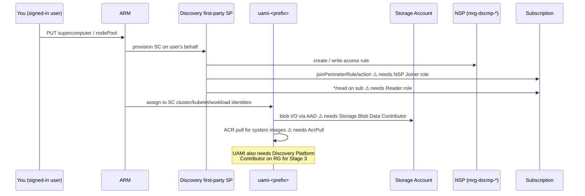

# RBAC role concept

Every Azure RBAC role assignment this deployment creates, who it's assigned to, where the scope sits, and what would break without it. Use this as the source of truth when reviewing access in a security audit or troubleshooting permission errors.

## Contents

- [Identity inventory](#identity-inventory)
- [Roles by scope](#roles-by-scope)
  - [Subscription scope — Discovery first-party SP](#subscription-scope--discovery-first-party-sp)
  - [Resource-group scope — UAMI `uami-<PREFIX>`](#resource-group-scope--uami-uami-prefix)
  - [Resource-group scope — your user (Platform Admin persona)](#resource-group-scope--your-user-platform-admin-persona)
  - [Workspace managed-RG scope — your user (Foundry User)](#workspace-managed-rg-scope--your-user-foundry-user)
- [Permission flow diagrams](#permission-flow-diagrams)
- [Common error → role mapping](#common-error--role-mapping)
- [What this repo does *not* do](#what-this-repo-does-not-do)
- [References](#references)

## Identity inventory

Three distinct identities touch this deployment:

| Identity | Who creates / owns it | Lifetime |
|---|---|---|
| **You** (signed-in user) | Your Entra tenant | Permanent |
| **`uami-<PREFIX>`** — User-Assigned Managed Identity | This Bicep ([02-supercomputer.bicep](02-supercomputer.bicep)) | Per-deployment |
| **Discovery first-party SP** (app id `92c174ac-8e41-4815-a1b7-d81b19ab03ce`) | Microsoft — provisioned in your tenant when you register `Microsoft.Discovery` RP | Per-tenant, persistent |

The three identities serve very different purposes — keep them mentally separate, especially when chasing a permission error.

## Roles by scope

### Subscription scope — Discovery first-party SP

Both granted by `./deploy.sh prereqs` via [`ensure_nsp_joiner_role`](deploy.sh) in [deploy.sh](deploy.sh). Required by the GA API `Microsoft.Discovery/*@2026-06-01`, *not* by the older preview API.

| Role | Type | Actions | Why it's needed |
|---|---|---|---|
| **Discovery NSP Perimeter Joiner** | Custom | `Microsoft.Network/networkSecurityPerimeters/joinPerimeterRule/action` | The Discovery SP creates an NSP inside its managed `mrg-dscmp-*` RG and must enroll your subscription into it. Without this you get `LinkedAuthorizationFailed`. |
| **Reader** | Built-in | `*/read` on the subscription | Required by NSP associations in **Enforced mode** so the Discovery control plane can enumerate resources before associating them. Without this you get `BadRequest: Control Plane service principal does not have Reader permission at subscription …`. |

Reference: [Microsoft Discovery NSP docs](https://learn.microsoft.com/en-gb/azure/microsoft-discovery/how-to-configure-network-security?tabs=azure-cli#assign-the-nsp-perimeter-joiner-role).

### Resource-group scope — UAMI `uami-<PREFIX>`

All three granted by [02-supercomputer.bicep](02-supercomputer.bicep) at Stage 2. These let the supercomputer's cluster / kubelet / workload identity do real work without storage keys.

| Role | Built-in role id | Scope target | Why it's needed |
|---|---|---|---|
| **Storage Blob Data Contributor** | `ba92f5b4-2d11-453d-a403-e96b0029c9fe` | Storage account `stg<prefix>…` | AAD-only auth path for the SC and its pods to read/write blobs. The storage account has `allowSharedKeyAccess: false`, so this is the only way in. |
| **Microsoft Discovery Platform Contributor** | `01288891-85ee-45a7-b367-9db3b752fc65` | Resource group | Lets the UAMI manage Discovery-managed resources (workspace, project, chat model deployment) on your behalf. |
| **AcrPull** | `7f951dda-4ed3-4680-a7ca-43fe172d538d` | Resource group | Lets the kubelet (UAMI used as `kubeletIdentity`) pull container images from Microsoft's Discovery container registry into your node pool. |

These role assignments use stable names — `guid(storageAccount.id, managedIdentity.id, roleId)` — so re-deploying Stage 2 is idempotent.

### Resource-group scope — your user (Platform Admin persona)

Optional but recommended. Assigned by `./deploy.sh roles [user-upn-or-objectid]`. Source: [Microsoft Discovery persona roles docs](https://learn.microsoft.com/azure/microsoft-discovery/how-to-assign-persona-roles).

| Role | Type | Why a *Platform Administrator* needs it |
|---|---|---|
| **Microsoft Discovery Platform Administrator (Preview)** | Built-in (preview) | Master role for managing Discovery resources (SC, workspace, projects). |
| **Managed Identity Contributor** | Built-in | Create/update UAMIs (needed to redeploy Stage 2). |
| **Managed Identity Operator** | Built-in | Assign UAMIs to other resources (SC, workspace). |
| **Storage Account Contributor** | Built-in | Manage storage account properties (lifecycle, CORS, network rules). |
| **Storage Blob Data Contributor** | Built-in | Read/write blobs from the Azure portal or `az storage blob …` as yourself. |
| **Network Contributor** | Built-in | Manage VNet, subnets, NSGs (needed for Stage 1 / future hardening). |
| **AcrPush** | Built-in | Push images into Microsoft's Discovery ACR if you need custom containers. |
| **Microsoft Discovery Bookshelf Index Data Reader (Preview)** | Built-in (preview) | Read the curated Bookshelf knowledge indexes that Discovery ships. |

> The [`Set-DiscoveryRoleAssignments.ps1`](https://learn.microsoft.com/en-gb/azure/microsoft-discovery/how-to-assign-persona-roles) script from Microsoft does the same thing in PowerShell.

### Workspace managed-RG scope — your user (Foundry User)

| Role | Type | Why it's needed |
|---|---|---|
| **Foundry User** | Built-in | After Stage 3 completes, Discovery creates a managed RG for the workspace (Azure AI Foundry resources). To open the workspace in Discovery Studio and use the chat model, assign yourself **Foundry User** on that managed RG. **Automated by `./deploy.sh 4`** (defaults to the signed-in az user; pass a UPN/object id to target someone else). |

To find the managed RG after Stage 3:

```bash
az resource list --resource-type Microsoft.Discovery/workspaces \
  --query "[?name=='ws-<PREFIX>'].properties.managedResourceGroup" -o tsv
```

Then in the Azure portal: that RG → Access Control (IAM) → Add → Foundry User → your user.

## Permission flow diagrams

### Stage 2 create path (where things break without RBAC)



## Common error → role mapping

| Error message | Missing role | Fix |
|---|---|---|
| `LinkedAuthorizationFailed` on `joinPerimeterRule/action` | Discovery NSP Perimeter Joiner (on Discovery SP, sub scope) | `./deploy.sh prereqs` |
| `Control Plane service principal does not have Reader permission at subscription` | Reader (on Discovery SP, sub scope) | `./deploy.sh prereqs` |
| `AuthorizationFailed` writing to storage from a pod | Storage Blob Data Contributor (on UAMI) | Re-run `./deploy.sh 2` (Bicep recreates the assignment) |
| `unauthorized: authentication required` pulling image | AcrPull (on UAMI) | Re-run `./deploy.sh 2` |
| Cannot create / list Discovery resources in Azure portal | Microsoft Discovery Platform Administrator on RG | `./deploy.sh roles` |
| Can see workspace but no chat / project access in Discovery Studio | Foundry User on workspace's managed RG | `./deploy.sh 4` (or assign manually in portal) |

## What this repo does *not* do

- **Custom kubelet ACR auth** — uses the default AcrPull on the same UAMI.
- **Network Security Perimeter scope changes** — only joins your sub to the NSP Discovery creates; doesn't add other resources.
- **Conditional Access / Entra App role consent** — assumed already in place for the tenant.
- **Foundry User on the workspace managed RG** — automated by `./deploy.sh 4` (one-shot post-Stage-3 helper); also assignable manually in portal.

## References

- [Resources deployed (full inventory)](resources-deployed.md)
- [Quickstart helper-script reference](quickstart.md)
- [Architecture and resource graph](architecture.md)
- [`deploy.sh`](deploy.sh) — `ensure_nsp_joiner_role`, `run_roles`, and the Bicep role assignments
- [Microsoft Discovery NSP docs](https://learn.microsoft.com/en-gb/azure/microsoft-discovery/how-to-configure-network-security?tabs=azure-cli)
- [Microsoft Discovery persona role docs](https://learn.microsoft.com/azure/microsoft-discovery/how-to-assign-persona-roles)
- [Azure built-in roles reference](https://learn.microsoft.com/azure/role-based-access-control/built-in-roles)
